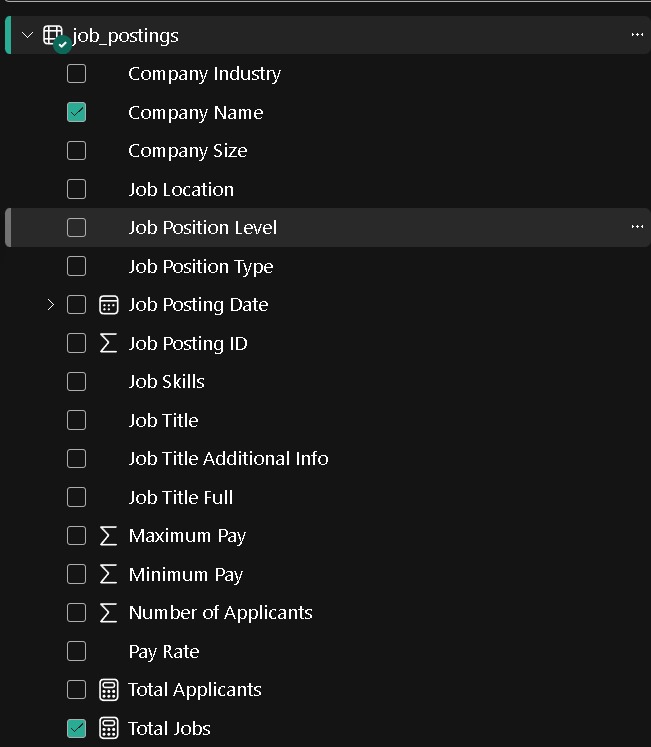

# 📊 Analyzing Job Market — Power BI Dashboard

<p align="center">


</p>

---

## 📌 About the Project

**Analyzing Job Market** is an interactive **Power BI dashboard** designed to analyze and understand job-market data through meaningful visualizations and interactive reports.

The project transforms raw job-related data into an easy-to-understand dashboard that helps users explore patterns, compare job opportunities, and identify useful insights from the dataset.

This project demonstrates practical skills in **data cleaning, data transformation, data analysis, DAX, data visualization, and dashboard design** using Microsoft Power BI.

---

## 🎯 Project Objectives

The main objectives of this project are:

- 📊 Analyze job-market data using Power BI
- 🔍 Identify important trends and patterns
- 📈 Compare different job-related categories
- 🧹 Clean and transform raw data
- 🧮 Create analytical calculations using DAX
- 🎨 Design an interactive and easy-to-understand dashboard
- 💡 Extract meaningful insights from the data
- 📑 Present analytical results through visual reports

---

## 🛠️ Tools & Technologies

| Technology | Purpose |
|---|---|
| 📊 **Microsoft Power BI** | Dashboard development and data visualization |
| 🔄 **Power Query** | Data cleaning and transformation |
| 🧮 **DAX** | Calculations, measures, and analysis |
| 📈 **Data Visualization** | Charts, KPIs, tables, and interactive visuals |
| 🗂️ **Data Modeling** | Organizing and connecting data |
| 🐙 **Git & GitHub** | Version control and project hosting |

---

## 📊 Dashboard Features

### 🔹 Interactive Dashboard

The dashboard provides an interactive interface for exploring different aspects of the job-market dataset.

Users can interact with charts, filters, and slicers to explore the information from different perspectives.

### 🔹 Data Cleaning

Raw data is processed and prepared before visualization using **Power Query**.

This helps improve data quality and makes the dataset suitable for analysis.

### 🔹 Data Transformation

The project uses Power Query transformations to prepare the data for analysis and reporting.

### 🔹 DAX Calculations

DAX is used to create analytical calculations and measures that support the dashboard's visualizations.

### 🔹 Interactive Filters

Slicers and filters allow users to focus on specific categories and explore the dataset interactively.

### 🔹 Visual Analysis

Charts, tables, KPIs, and other Power BI visuals are used to present the data in a simple and understandable way.

---

## 📸 Dashboard Preview

### 🖥️ Dashboard Overview


### 📈 Job Market Analysis


### 🔍 Additional Insights



> **Note:** Make sure these image files exist inside the `screenshots` folder with the exact filenames shown above.

---

## 📈 Project Workflow

```text
        Raw Job Data
              │
              ▼
       Data Cleaning
              │
              ▼
     Data Transformation
              │
              ▼
        Data Modeling
              │
              ▼
       DAX Calculations
              │
              ▼
      Data Visualization
              │
              ▼
   Interactive Power BI Dashboard
              │
              ▼
        Job Market Insights
